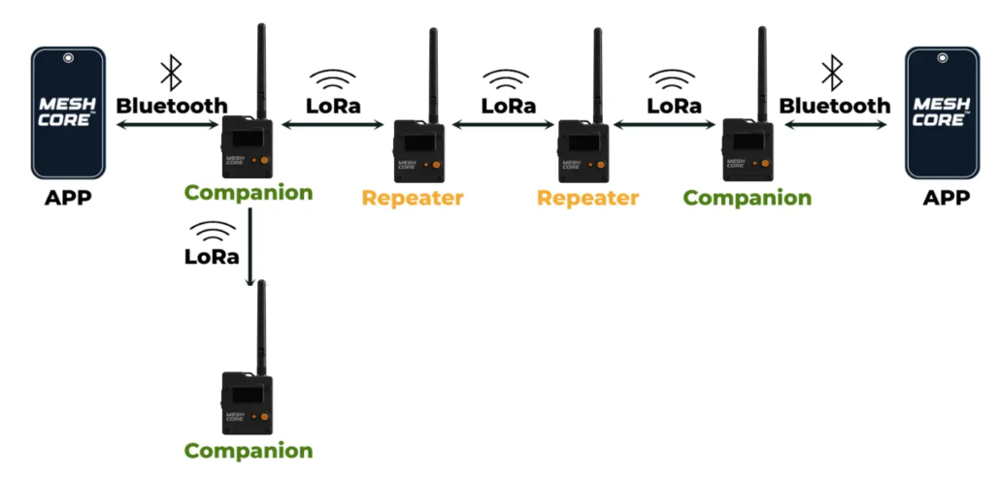
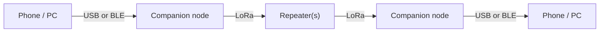
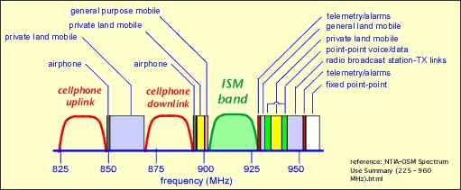

# MeshCore Beginner Guide

---

## What is MeshCore?

MeshCore is firmware that turns a cheap LoRa radio board (like a Heltec or RAK device) into a node on an off-grid, encrypted text-messaging mesh. It needs no supporting infrastructure to run: your phone talks to a small radio over USB or Bluetooth, and that radio relays messages to other radios directly over the air.



The typical path a message takes:



- **Companion node** — your personal radio. It pairs with the MeshCore app on your phone and is the device you actually send messages from.
- **Repeater** — an infrastructure node, usually placed up high (a roof, a hill), whose only job is to forward traffic and extend the network's reach.
- **Room server** — an optional node that stores messages so a group can read them even if they were offline when the message was sent (more on this below).

---

## MeshCore vs. Meshtastic

**Meshtastic** treats every node the same. When you send a message, every node that hears it rebroadcasts it ("managed flooding"). This is simple and works great with a handful of devices, but as the network grows, all that rebroadcasting competes for the same airtime and the network congests. Every device is both a phone and a repeater whether you want it to be or not.

**MeshCore** separates **devices** from **infrastructure**. Your phone-paired companion node is not constantly relaying everyone else's traffic — that job is given to dedicated repeaters you deliberately place for coverage. Just as important, MeshCore *learns paths*: the first time you message someone, the packet floods the network to find them, but once a route is known, later messages follow that specific path instead of flooding everyone. Less wasted airtime means the network scales to far more nodes.

**In short, MeshCore is usually the better choice when:**

- You want the network to grow beyond a dozen or so nodes.
- You want to plan coverage with a few well-placed repeaters rather than hoping every handheld relays well.
- You care about efficient airtime use and predictable routing.

---

## LoRa and the ISM Band

### LoRa = "Long Range"

LoRa is a way of encoding data into radio waves that trades **speed for distance and toughness**. Instead of blasting data quickly (like Wi-Fi), it sends slowly using a "chirp" signal that's easy for a receiver to pick out even when it's faint or buried in noise. The result: a tiny, battery-powered radio can reach **several kilometers** in open terrain — sometimes tens of kilometers with line of sight to a hilltop repeater.

The trade-off is **bandwidth**. LoRa is *slow* — think text messages, not photos or voice. A single message can take a second or more to transmit, so keeping messages short keeps the network healthy.

### The ISM band = license-free public airwaves

Radio spectrum is regulated, but governments set aside **ISM bands** (Industrial, Scientific, Medical) that anyone can use without a license — the same idea that lets Wi-Fi and Bluetooth exist. LoRa uses the *sub-gigahertz* ISM bands, which travel farther and punch through walls and trees better than 2.4 GHz Wi-Fi.

Which frequency you use depends on **where you live**, and every node on your mesh **must match**:

| Region | Frequency |
|--------|-----------|
| North America | 915 MHz |
| Europe / UK | 868 MHz |
| Some regions | 433 MHz |

Two consequences of sharing public airwaves:

- **It's a shared, noisy space.** Other devices use it too, so there's no guaranteed bandwidth.
- **There are local rules.** Europe's 868 MHz band, for example, enforces a **duty cycle** limit (roughly 1% — a node may only transmit a small fraction of the time). MeshCore respects these limits, which is another reason to keep traffic light.



---

## Setting Up

There are two parts: **flash** the firmware onto your board, then **connect** to it from the app.

### Step 1: Flash Your Board

**Goal:** Put MeshCore firmware on your radio. You'll flash one of two roles — **Companion** (for your personal device) or **Repeater** (for an infrastructure node).

#### Option A: Web Flasher (easiest)

1. Plug your board into your computer with a USB cable.
2. Open **https://meshcore.co.uk/flasher.html** in **Google Chrome or Microsoft Edge**.
3. Select your board model (e.g. Heltec V3, Heltec V4, RAK4631).
4. Choose the firmware **role** — *Companion (BLE)* for a phone-paired device, or *Repeater* for an infrastructure node — and the latest version.
5. Click flash, pick the serial port when the browser asks, and wait.

> **Browser matters:** the web flasher uses the **Web Serial API**, which only works in Chromium-based browsers (Chrome, Edge, Brave). **Firefox and Safari can't talk to serial devices**, so the flash button won't work there. If your browser can't see the device, use esptool below.

#### Option B: esptool (fallback for ESP32 boards)

This works for ESP32-based boards (Heltec V2/V3/V4). Install Python and esptool:

```bash
sudo apt update
sudo apt install python3 python3-pip
pip install esptool
```

Find your board's serial port:

```bash
ls /dev/ttyUSB* /dev/ttyACM*
```

- Heltec V2/V3: usually `/dev/ttyUSB0`
- Heltec V4: usually `/dev/ttyACM0`

Download the firmware `.bin` for your board and role from the flasher page, then flash it.

**Companion (Bluetooth) firmware:**

```bash
esptool --chip esp32s3 --port /dev/ttyACM0 --baud 921600 \
  write-flash 0x0 ./heltec_v4_companion_radio_ble-v1.15.0-merged.bin
```

**Repeater firmware:**

```bash
esptool --chip esp32s3 --port /dev/ttyACM0 --baud 921600 \
  write-flash 0x0 ./heltec_v4_repeater-v1.14.1-merged.bin
```

> **What's `merged.bin` and the `0x0`?**
> Flash memory on an ESP32 holds several pieces: a bootloader, a partition table, and the actual app. Normally each piece is written to its own address (the bootloader at `0x0`, the partition table at `0x8000`, the app at `0x10000`). A **`merged.bin`** glues all of those into one file, so you can write the whole thing in a single command at offset **`0x0`** (the very start of flash). It's the foolproof option — that's why the commands above use it. A plain `.bin` is just the app and would need the other pieces flashed at their correct offsets.

> **Permission denied on the serial port? (LINUX ONLY)** Add yourself to the `dialout` group, then log out and back in:
> ```bash
> sudo usermod -aG dialout $USER
> ```

### Step 2: Connect from the MeshCore App

**Goal:** Pair your phone with the companion node and send your first message.

1. Install the **MeshCore** app from the iOS App Store or Google Play. (A browser-based client also exists at **client.meshcore.co.uk** if you'd rather not install anything.)
2. Power on your companion node and make sure Bluetooth is on.
3. In the app, **scan for devices** and select your node.
4. **Pair with the PIN** when prompted (commonly `123456` by default — you can change it later).
5. Set your node's **name** and confirm the **region/frequency** matches everyone else's mesh.
6. Tap to send an **advert** (announcement). This is how the rest of the mesh discovers you and learns the path back to you. Once your contacts' adverts arrive, you can tap a contact and start chatting.

---

## How MeshCore Works

### Identities and IDs

When you first set up a node, it generates a **cryptographic key pair** — a public key it shares and a private key it keeps secret. Your node's identity *is* that key, not the friendly name you typed in. Names are just labels for humans; the keys are what the network and the encryption rely on. Because identity comes from the public key, **messages are end-to-end encrypted** to the recipient: repeaters in the middle forward the bytes but cannot read them.

### Adverts (how nodes find each other)

A node announces itself by broadcasting an **advert** containing its public key and name. Adverts are **flood-routed** — passed along by repeaters across the whole mesh — so every node gets to know who exists and, crucially, *which direction* traffic should go to reach them. This is how the network builds its picture of who's out there.

### Routing (flood first, then direct)

This is MeshCore's signature behavior:

1. **First contact → flooding.** The very first message to a new contact is flooded outward until it finds them.
2. **After that → direct path.** The route discovered during flooding gets remembered, and subsequent messages travel that specific chain of repeaters instead of bothering the whole network.

Every packet also carries a **hop limit** (a maximum number of relays it's allowed to make), so traffic can't bounce around the mesh forever.

### Store and Forward

LoRa nodes aren't always reachable — someone's radio might be off, out of range, or asleep. **Store and forward** means a node holds onto a message and delivers it later when the recipient becomes reachable. In MeshCore this is the job of a **room server**: it acts like a shared bulletin board or group chat that stores messages, so members can sync up and read what they missed even though they weren't online at the time. Plain repeaters, by contrast, only forward in the moment, they don't store anything.

## Resources

- [MeshCore Web Flasher](https://meshcore.co.uk/flasher.html)
- [MeshCore Website](https://meshcore.co.uk/)
- [esptool documentation](https://docs.espressif.com/projects/esptool/)
</content>
</invoke>
